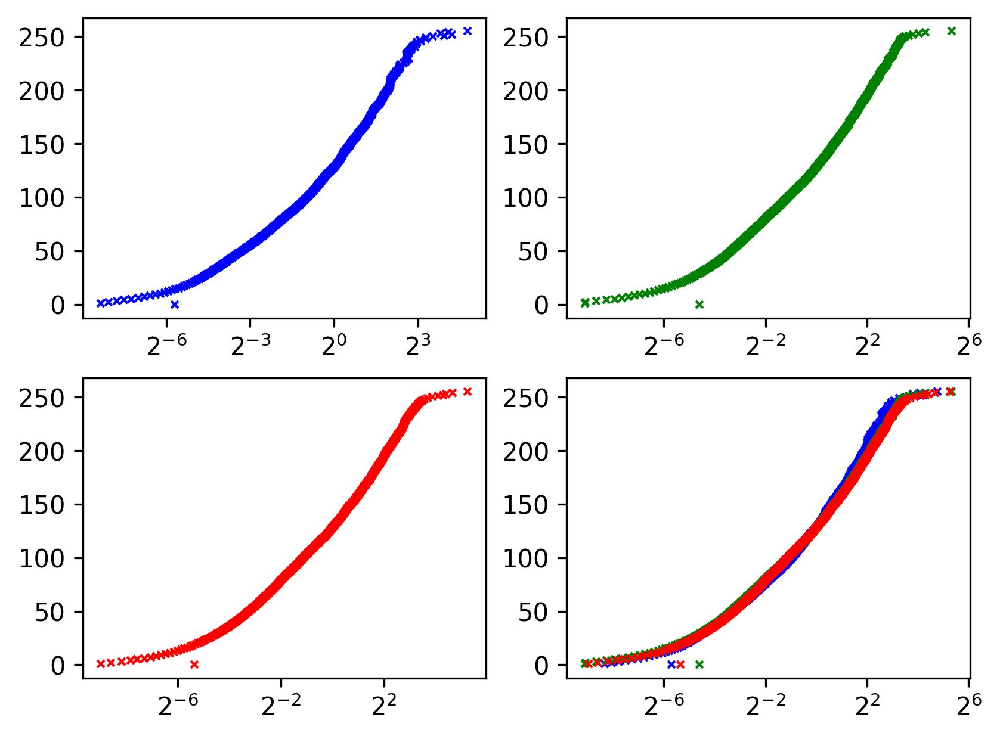

# VFX HW1: High Dynamic Range Imaging

This is a Python implementation of

- Alignment: Median Threshold Bitmap (MTB)
- HDR: Debevec’s and Robertson’s method
- Tone mapping: Reinhard's method - global and local (dodge and burn) operator

## Requirements

- numpy
- opencv-python
- matplotlib

## Usage

```
cd code && ./run.sh
```

## Results

- HDR: Robertson’s method, threshold = 1e-6
- Tone mapping: Reinhard's local operator, alpha = 0.09, phi = 8, gamma = 0.46

### Response Curve



### Result


## Reference

1. Paul E. Debevec, Jitendra Malik, Recovering High Dynamic Range Radiance Maps from Photographs, SIGGRAPH 1997.

2. Mark Robertson, Sean Borman, Robert Stevenson, Estimation-Theoretic Approach to Dynamic Range Enhancement using Multiple Exposures, Journal of Electronic Imaging 2003.

3. Erik Reinhard, Michael Stark, Peter Shirley, Jim Ferwerda, Photographics Tone Reproduction for Digital Images, SIGGRAPH 2002.